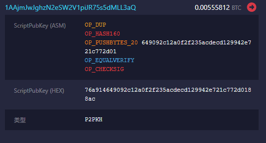
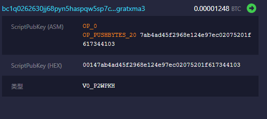
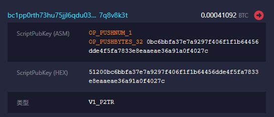

# legacy、segwit、taproot地址比较

Pic.1 Legacy

Pic.2 Segwit

Pic.3 Taproot
## 地址比较
1. **legacy地址(P2PKH)**
    * 以'1'开头
    * 34位字符
    * e.g.：`1AAjmJwJghzN2eSW2V1piJR75s5dMLL3aQ`

2. **segwit地址(P2WPKH)**
    * 以'bc1q'开头
    * 42位字符
    * e.g.：`bc1q0262630jj68pyn5haspqw5sp7ctngsgratxma3`

3. **taproot地址(P2TR)**
    * 以'bc1p'开头
    * 62位字符
    * e.g.：`bc1pp0rth73hu75jjl6qdu03kez9dh0y7ha8svlga2h2ud4frg85qf7q8v8k3t`

## 锁定脚本比较
1. **legacy锁定脚本(P2PKH)**
    * OP_DUP(复制栈顶) OP_HASH160(对复制内容哈希) 20 byte的hash OP_EQUALVERIFY(判等) OP_CHECKSIG(验证公钥和签名)
    * e.g.：`76a914649092c12a0f2f235acdecd129942e721c772d0188ac`
2. **segwit锁定脚本(P2WPKH)**
    * OP_0 20byte的hash
    * e.g.：`0014946e577446d36f1fdb7ae1f16e9ec36ee3a5f24b`
3. **taproot锁定脚本(P2TR)**
    * OP_PUSHNUM_1 32byte的hash 
    * e.g.：`51200bc6bbfa37e7a9297f406f1f1b64456dde4f5fa7833e8eaaeae36a91a0f4027c`